# RedrankAI -- Candidate Intelligence Engine

RedrankAI is an offline-first, high-performance candidate ranking web application built for the **Redrob Data & AI Challenge**. It evaluates and ranks **100,000 candidates** against any job description in under 12 seconds using a multi-signal scoring system.

---

## How It Works

The flowchart below shows the full journey from when you type a job description to when you see the ranked list of candidates.

```mermaid
flowchart TD
    A([You open the website]) --> B[The app loads 100,000\ncandidate profiles in the background]
    B --> C{Profiles ready?}
    C -- Not yet --> D[Loading indicator shown\nApp waits silently]
    D --> C
    C -- Yes --> E([You type a job description\nand click 'Find Best Candidates'])

    E --> F[The app reads your job description\nand pulls out the important keywords\neg. Python, NLP, Bangalore, 5 years]

    F --> G[It also expands synonyms automatically\neg. 'ML' becomes 'machine learning',\n'Bangalore' matches 'Bengaluru' too]

    G --> H[Every candidate in the database\ngoes through 6 scoring checks]

    subgraph scoring [Scoring -- done for all 100,000 candidates]
        H1[Skills Match\nDoes the candidate know\nthe tools you need?]
        H2[Career History\nHave they actually worked\nin a relevant role?]
        H3[Experience Fit\nDo their years of experience\nmatch what you asked for?]
        H4[Education\nWhat degree and institution\ndo they have?]
        H5[Platform Signals\nAre they active, responsive,\nand verified on the platform?]
        H6[Availability\nAre they open to work and\nhow soon can they join?]
    end

    H --> scoring

    scoring --> I[Each candidate gets a\ncombined score from 0 to 1]

    I --> J{Honeypot Check:\nDoes the profile make sense?}

    subgraph honeypot [Consistency Check -- flags fake or padded profiles]
        J1[Claims 'expert' skill but\nhas used it for 0 months?]
        J2[Says 15 years of experience but\nwork history only adds up to 2 years?]
        J3[Job dates say 6 months but\nthey wrote 48 months?]
        J4[Graduated before\nthey even enrolled?]
    end

    J --> honeypot
    honeypot --> K{Any red flags found?}
    K -- Yes --> L[Score is multiplied down\neg. 3 red flags = score goes to ~15%\nof original. Pushed to the bottom.]
    K -- No --> M[Score stays as-is]

    L --> N
    M --> N[Location check:\nIs the candidate in the city you want?]
    N -- Wrong city, won't relocate --> O[Score reduced by 95%]
    N -- Wrong city but open to relocate --> P[Score reduced by 50%]
    N -- Correct city --> Q[Score unchanged]

    O --> R
    P --> R
    Q --> R[All 100,000 candidates are sorted\nby final score, highest first]

    R --> S[Top N candidates are sent\nback to your browser]

    S --> T([You see ranked candidate cards\nwith scores, matched skills,\nreasoning, and full profile details])
```



---

## Features

* **Multi-Signal Ranking:** Scores profiles across 6 dimensions: Skills, Career Trajectory, Experience Fit, Education Quality, Behavioral signals, and Availability.
* **Honeypot Detection:** Automatically identifies and penalizes internally inconsistent profiles where claims contradict the supporting data (fake experience, impossible dates, zero-use expert skills).
* **Dynamic Location Resolution:** Matches target cities from your job description and groups regional aliases (e.g. Noida, Gurgaon) to canonical zones (e.g. Delhi NCR) automatically.
* **Performance Optimized:** Uses pre-normalized profile ingestion and cached query constants to evaluate 100k records in under 12 seconds.
* **Adjustable Priorities:** Real-time adjustable scoring weight sliders and advanced filters for experience range, work mode, and notice period.
* **Fully Responsive UI:** Minimalist, editorial layout adapting to mobile and desktop screens.

---

## Project Structure

```
RedrankAI/
|
+-- app.py                      # Flask Server, API Routing, and background dataset caching
+-- scoring.py                  # Hybrid scoring engine, honeypot detection, and keyword extraction
+-- validate_submission.py      # Standalone verification script for challenge requirements
+-- Dockerfile                  # Containerization environment script
+-- render.yaml                 # Configuration for Render cloud deployments
+-- requirements.txt            # Python dependencies (Flask, Gunicorn)
|
+-- data/                       # Configs, fallbacks, and databases
|   +-- config.json             # Decoupled default weights, domain vocabulary, and city mappings
|   +-- candidates.jsonl        # The high-scale dataset of 100,000 candidates (Git-ignored)
|   +-- sample_candidates.json  # Fallback demo candidate dataset
|   +-- candidate_schema.json   # JSON schema document detailing candidate profile structure
|
+-- static/                     # Web assets (Modular frontend structure)
    +-- index.html              # HTML DOM scaffolding
    +-- app.js                  # Frontend controllers, slider listeners, and async fetching
    +-- style.css               # CSS entry point importing modular components
    +-- tokens.css              # Reset rules, design tokens (variables), and custom cursor styles
    +-- layout.css              # Navbars, hero sections, footers, and grid boundaries
    +-- form.css                # Textareas, select tags, parameter sliders, and buttons
    +-- results.css             # Candidate cards, radial gauges, and stats dashboard layouts
```

---

## Getting Started

### Prerequisites

```bash
pip install Flask
```

### Local Setup

1. Start the server from the project directory:
   ```bash
   python3 app.py
   ```
2. Navigate to `http://localhost:5050` in your web browser.
